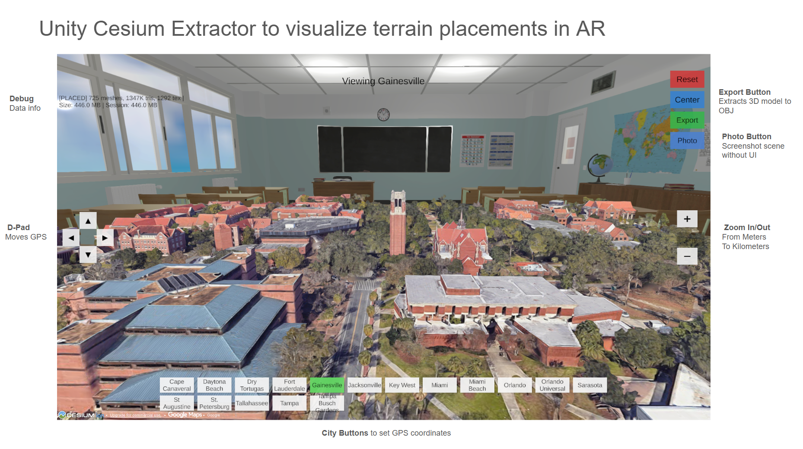
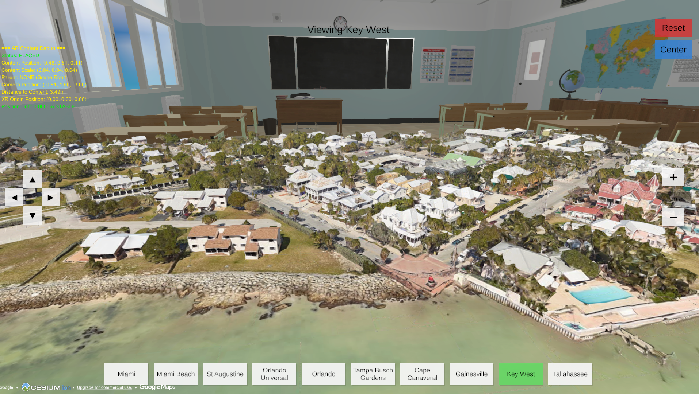
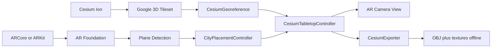
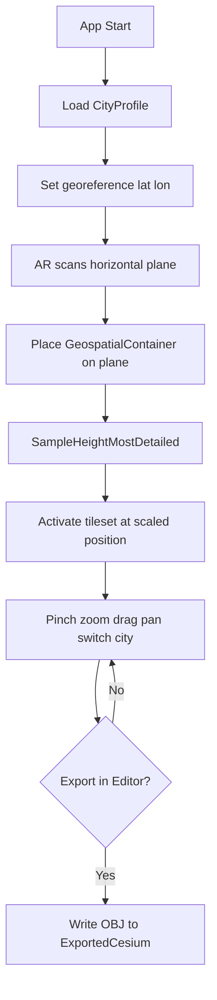
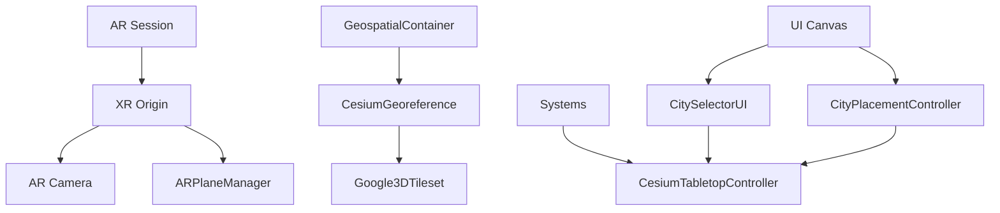
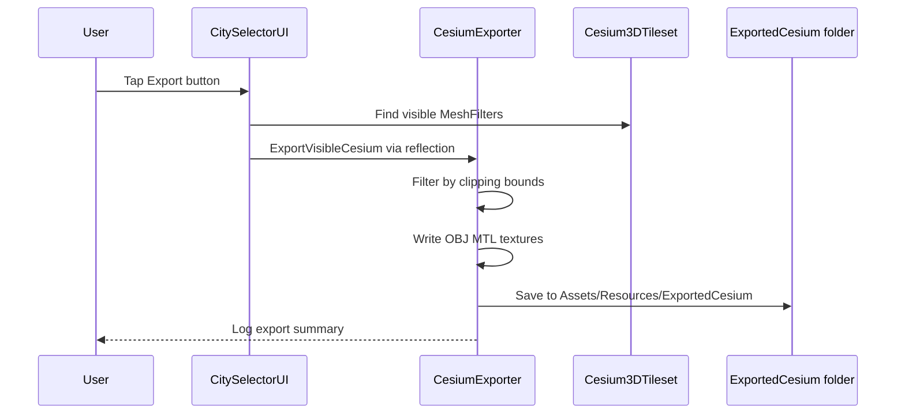

# Unity Cesium Extractor

An educational Unity asset package for streaming Google Photorealistic 3D Tiles via Cesium for Unity, viewing them in tabletop-scale AR, and exporting visible geometry to OBJ for offline use. Developed at the **University of Florida** for AR Expeditions app development and research.





## Educational Use and Attribution

This tool is intended **only for educational and research purposes** — such as learning geospatial AR pipelines, experimenting with Cesium integration, and caching streamed tiles for offline AR viewing in controlled academic settings.

- **Respect terms of service:** Google Maps Platform, Cesium Ion, and related providers govern how their data may be used. Follow their licensing and attribution requirements at all times.
- **Not for IP theft:** Do not use this project to scrape, redistribute, or commercially exploit proprietary map imagery, meshes, or textures.
- **Attribution required:** When displaying Google Photorealistic 3D Tiles, keep on-screen credits enabled (`showCreditsOnScreen` on the tileset) and comply with provider attribution guidelines.

Scripts from the parent project's **Florida Navigation Game** (quiz mini-game) were intentionally excluded from this extract.

---

## What This Package Does

1. **Stream** photorealistic 3D terrain and buildings from Cesium Ion (Google asset ID `2275207`).
2. **Place** the miniature city on an AR horizontal plane using AR Foundation.
3. **Navigate** with pinch-to-zoom, drag-to-pan, city switching, and height controls.
4. **Export** currently visible clipped meshes to OBJ + MTL + PNG textures (Editor only).

---

## Quick Start

1. Copy this entire folder into your Unity project's `Assets/` folder (e.g. `Assets/UnityCesiumExtractor/`).
2. Create a **3D (URP)** Unity project (2022.3 LTS or newer).
3. Install packages:
   - **Cesium for Unity** 1.13+ ([scoped registry](https://cesium.com/learn/unity/unity-quickstart/))
   - **AR Foundation** 5.1+, ARCore and/or ARKit plugins
   - **XR Interaction Toolkit** 3.0.4+ with **AR Starter Assets** sample
   - **TextMesh Pro**
4. Configure your **Cesium Ion access token** (Cesium → Cesium ion → Connect).
5. Open `Scenes/UnityCesiumExtractor.unity`, or run **Unity Cesium Extractor → Build Scene** to regenerate the scene.
6. If city profiles are missing, run **Unity Cesium Extractor → Generate City Profiles**.
7. In the Editor, place the scene, let tiles load, then tap **Export** or use **Unity Cesium Extractor → Export Visible Cesium (OBJ)**.

---

## Project Structure

```
Unity Cesium Extractor/
├── README.md
├── Editor/
│   ├── BatchMaterialUpdater.cs       # Post-export: double-sided materials
│   ├── CesiumExporter.cs             # OBJ/MTL/texture export
│   ├── CityProfileGenerator.cs       # Generate Florida city ScriptableObjects
│   ├── CesiumExtractorSceneBuilder.cs # Programmatic scene setup
│   └── MaterialTextureEnhancer.cs    # Post-export: unlit/bright materials
├── Resources/
│   └── FloridaCities/                # 17 sample CityProfile assets
├── Scenes/
│   └── UnityCesiumExtractor.unity
└── Scripts/
    ├── ARContentDebugger.cs
    ├── ARPlaneVisualizer.cs
    ├── CesiumTabletopController.cs   # Core georeference + placement
    ├── CityPlacementController.cs    # AR input (tap, pinch, drag)
    ├── CityProfile.cs
    └── CitySelectorUI.cs             # UI + export trigger
```

### Included vs. Required Externally

| Included in this extract | Required in host Unity project |
|--------------------------|--------------------------------|
| Runtime + Editor scripts | Unity 2022.3 LTS+ with URP |
| Sample scene + city profiles | Cesium for Unity 1.13+ |
| OBJ export tooling | Cesium Ion access token |
| Material fix editor tools | AR Foundation 5.1+ |
| | XR Interaction Toolkit AR Starter Assets sample |
| | TextMesh Pro |

---

## System Architecture



---

## Runtime Placement Flow



---

## Scene Component Graph



---

## Export Pipeline



Exports are written to `Assets/Resources/ExportedCesium/Cesium_{lat}_{lon}_{height}_{timestamp}/`.

---

## Editor Menu Items

| Menu | Purpose |
|------|---------|
| Unity Cesium Extractor → Generate City Profiles | Create/update `Resources/FloridaCities/*.asset` |
| Unity Cesium Extractor → Build Scene | Rebuild `UnityCesiumExtractor.unity` from scratch |
| Unity Cesium Extractor → Export Visible Cesium (OBJ) | Export clipped visible tiles |
| Tools → Batch Update Materials | Fix double-sided rendering on exported meshes |
| Tools → Material Texture Enhancer | Brighten/flatten materials on exported meshes |

---

## Core Scripts

### CesiumTabletopController

Manages georeference origins, world scaling (tabletop "Godzilla" effect), polygon clipping, terrain height sampling via `SampleHeightMostDetailed`, pan/zoom, and tileset activation.

### CityPlacementController

Handles AR plane detection, auto-placement, tap-to-place, pinch-to-zoom, drag-to-pan, and double-tap focus. This is the primary input handler for the AR experience (not a custom `ARInputManager` script — AR Foundation's built-in `ARInputManager` component is added separately on the AR Session).

### CitySelectorUI

Dynamic city buttons, status display, D-pad movement, zoom controls, mesh/texture statistics, screenshot capture, and export button (Editor only).

### CityProfile (ScriptableObject)

```csharp
[CreateAssetMenu(fileName = "NewCityProfile", menuName = "Unity Cesium Extractor/City Profile")]
public class CityProfile : ScriptableObject
{
    public string cityName;
    public string description;
    public Sprite thumbnail;
    public double latitude;
    public double longitude;
    public double defaultHeight = 100.0;
    public float initialScale = 0.005f;
}
```

---

## Technology Stack

| Component | Version | Purpose |
|-----------|---------|---------|
| Unity | 2022.3 LTS or 6000.0+ | URP rendering, physics |
| AR Foundation | 5.1+ | ARCore / ARKit abstraction |
| Cesium for Unity | 1.13.0+ | 3D Tiles streaming, georeference |
| Google Photorealistic 3D Tiles | Ion asset `2275207` | Mesh + texture data |
| XR Interaction Toolkit | 3.0.4+ | XR Origin (AR Rig) prefab |

---

## Tabletop Scale Architecture

In standard Cesium, 1 Unity unit = 1 meter. For tabletop AR, **scale the world down** (e.g. `GeospatialContainer.localScale = 0.002` for 1:500) rather than scaling the camera. This avoids depth-buffer precision issues and keeps AR plane physics stable.

Vertical alignment uses `Cesium3DTileset.SampleHeightMostDetailed` so terrain sits flush on the detected AR plane instead of floating or sinking.

---

## Tileset Configuration (Mobile AR)

| Setting | Recommended Value | Notes |
|---------|-------------------|-------|
| Ion Asset ID | `2275207` | Google Photorealistic 3D Tiles |
| Maximum Screen Space Error | 16–32 | Higher = fewer tiles, better performance |
| Maximum Cached Bytes | 512 MB | Prevents mobile OOM |
| Enable Frustum Culling | **Off** | Load tiles in all directions for AR |
| Show Credits On Screen | **On** | Required attribution |

---

## Sample Florida Cities

The included `Resources/FloridaCities/` folder contains 17 educational demo locations (Miami, Gainesville/UF, Cape Canaveral, etc.). Add your own `CityProfile` assets for any coordinates worldwide.

---

## Removed from Parent Project

These scripts were copied accidentally and are **not** part of Unity Cesium Extractor:

- `CityMarkerManager.cs` — Florida Navigation Game city markers
- `FloridaNavigationGame.cs`, `NavigationQuestionData.cs`, etc. — quiz game logic
- `FixIosLdFlags.cs` — Firebase iOS linker workaround
- `EnvironmentMaterialAutoFixer.cs` — runtime material fixer for unrelated environment meshes

---

## Appendix: References

Key documentation and community resources used during development:

1. [Cesium for Unity Quickstart](https://cesium.com/learn/unity/unity-quickstart/)
2. [AR Foundation Manual](https://docs.unity3d.com/Packages/com.unity.xr.arfoundation@5.0/manual/index.html)
3. [Cesium Community — Scaling and Georeferencing](https://community.cesium.com/t/scaling-and-georeferencing/23695)
4. [SampleHeightMostDetailed — Cesium for Unity](https://community.cesium.com/t/how-to-get-height-of-lat-and-long-i-want-to-place-an-object-on-the-surface/25958)
5. [Google ARCore Depth/Occlusion](https://developers.google.com/ar/develop/unity-arf/depth/developer-guide)
6. [Cesium Performance Guide for Unity](https://community.cesium.com/t/performance-improvement-guide-for-unity/31631)
